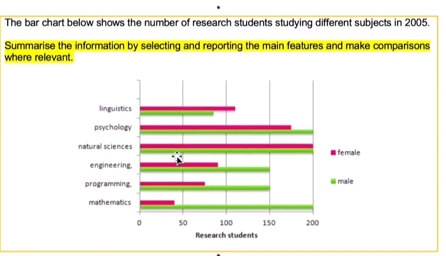

The bar chart preseents the distribution about number of students studying different subjects in 2005. The plot is depicted from two aspects: gender and subjects.  Subjects include linguistics, psychology, natural sciences, engineering, programming, and mathematics.

Overall, there are more male students than counterpart in most subjects.  The most studied subjects is natural sciences and the least one is lingusitics.Considering male students, the most studied subjects is mathematics and the least one is linguistics. For female students, the most one is natural sciences and the least is mathematics.

In natural sciences, there are qual number of students in terms of gender. while the subject of mathematics shows extremely  gap. Specifically, number of male students achieves 200 while the counterpart reachs out about 40.  The same stuation exists in enginnering, psychology, and programming. Numer of male students outperforms female students in all subjects except for linguistics, where the number outperforms 150 and in linguistics the number is less than 100.  We can draw the conclusion that male students perfer to study mathematics natural sciences and psychology and female students perfer to study natural sciences, linguistics and psychology.